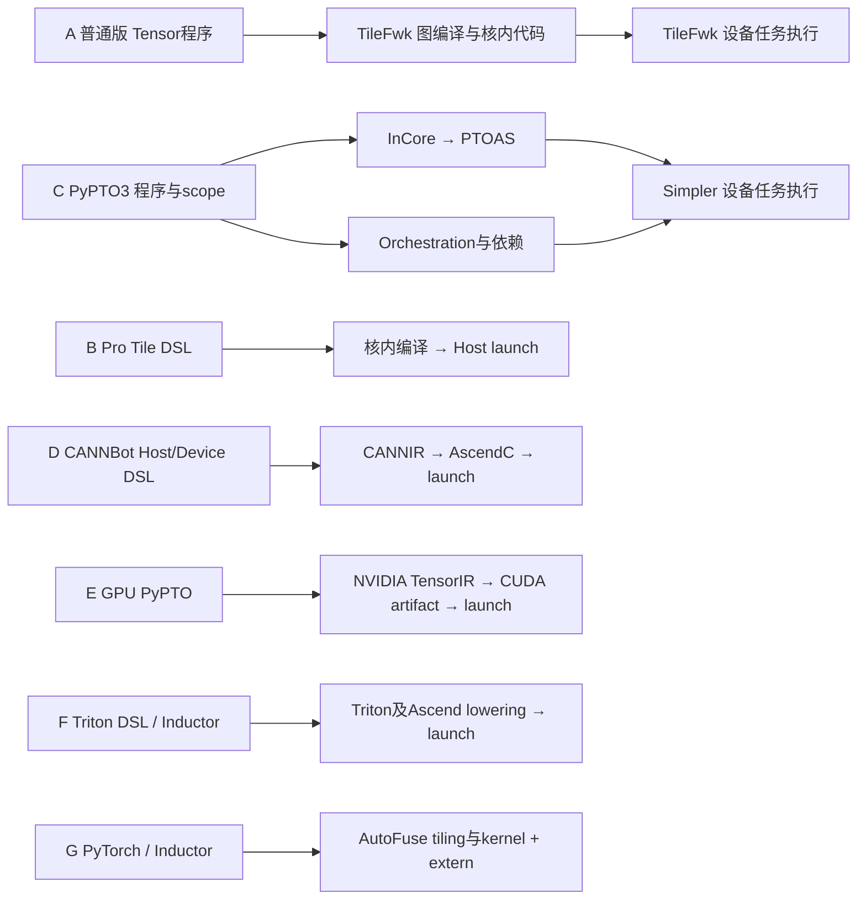

# NPU / GPU 七条编程与执行路径：A5 实测、编译分层与 megaKernel 边界

核对日期：2026-09-07。本文以指定版本的代码和本 session 的 A5 实测为依据，比较 PyPTO2 普通版、PyPTO2 Pro、PyPTO3（Simpler）、CANNBot DSL、PyPTO on GPU、Triton-Ascend、AutoFuse + Inductor。`pypto-lib` 归入 PyPTO3；graph-autofusion 仅讨论 AutoFuse，SuperKernel 不在比较范围内。

**当前事实：四条 NPU DSL 路线的原生 PA 用例直接通过；普通版 PyPTO2 的组合程序需要本地两行修正；AutoFuse 的分页图表达通过，但仍含外部算子。已有证据不足以对七条路线做性能排名。** 上游实现见各行代码链接；本轮执行结果由[实测清单][RUN-results]及其日志支撑。

本文明确区分三类证据：**代码事实**说明此版本实现了什么；**本机实测**说明哪些输入已完成编译、执行及数值校验；**架构判断/分析模型**说明相近之处、优化机会或代价，不当作测量结果。上游代码链接固定到 GitHub/GitCode 的 commit；CANNBot 按约定继续引用本地工作区。新增驱动、补丁、日志在本机产生，随文归档到本仓库的实测证据快照，单独标注其来源。

阅读导航：[实测结论](#conclusions) → [用户表达与算子契约](#examples) → [前端能力](#frontend-capabilities) → [编译执行分层](#layers) → [重点对比](#focused-comparisons) → [MLIR及后端](#mlir) → [megaKernel](#megakernel) → [动态scheduler](#scheduler-performance) → [动态tiling](#dynamic-tiling) → [核内融合](#intra-kernel-fusion) → [GPU launch](#gpu-launch) → [替代与共用](#replacement) → [相似性判断](#nearest)。

<a id="conclusions"></a>
## 1. A5 上实际验证到了哪一步

### 1.1 环境与结果

设备为 `Ascend950PR_957b`，物理 NPU 4 映射为逻辑 `npu:0`；CANN 为 `9.2.0-weekly.20260902.01`，驱动为 `25.7.rc1.2`。多数路线使用 Torch 2.10 / torch_npu 2.10.post4；AutoFuse 使用独立的 Torch / torch_npu 2.12 环境。PyPTO3 使用 Simpler 的固定子模块和 PTOAS v0.57；Triton-Ascend 为本地构建的 3.6.0。源码、工具链及本地构建改动的版本摘要见[环境记录][RUN-env]。这些是共享机器上的直接正确性运行，pytest 总耗时不代表算子延迟。

| 标识与路线 | 完整实现 / 原测试来源 | 本轮 PA 结果 | 已验证的范围 |
| --- | --- | --- | --- |
| A — PyPTO2 普通版 | [ctrl_perf_kernel][A-pa] | **原版精度失败；本地修正版通过** | 前处理→KV写入→PA；FP16，B=4，Hq/Hkv=8/1，D=128，页大小128，L=127/128/129/513 |
| B — PyPTO2 Pro | [flex_attention_bf16][B-pa]、[页大小测试][B-pa-test] | **通过** | BF16；页大小128/256/512的prefill，以及补充的单token decode；后者L=127/128/129/513 |
| C — PyPTO3（Simpler） | [通用 PA 程序][C-pa]、[PTOAS 测试][C-pa-test] | **2例通过** | B=64，Hq/Hkv=16/1，D=128，页大小128，L=8192及8100；BF16输入、FP32输出 |
| D — CANNBot DSL | [paged kernel][D-pa]、[原测试][D-pa-test] | **2个原用例及1个decode用例通过** | FP16，D=128，页大小128；无mask多query attention；B=4、Hq/Hkv=9/1、Q长度1、L=512的decode |
| E — PyPTO on GPU | [paged_attention_decode][E-pa]、[benchmark入口][E-pa-test] | **本轮未执行** | 当前是NPU环境；保留代码事实，历史GPU测量另行说明 |
| F — Triton-Ascend | [paged_attention_fwd][F-pa]、[原测试][F-pa-test] | **8例通过** | FP16，页大小16；MHA/GQA、causal prefill/decode；QK维32/48、V维32，含KV尾页 |
| G — AutoFuse + Inductor | [Inductor接入][G-register]、[融合调度][G-scheduler]；本地使用同一分页图表达 | **图级2组长度通过** | BF16，B=3，Hq/Hkv=40/8，D=128；L=[1,129,513]及[127,128,512]；含外部gather/bmm |

这张表不能简化成“所有原版 PA 已通过”。A 有已复现的原版失败；C 的实测对象是通用多任务 PA；G 验证的是图表达及其混合执行结果。各路线的布局、dtype、scale、reference 和规模不一致。[完整结果与容差][RUN-results]

### 1.2 三项改变原有判断的事实

**普通版 PyPTO2：运行成功不等于 KV 更新语义正确。** 原文件是控制CPU性能看护程序，未提供 attention golden。新增完整参考计算后，原版最大绝对误差为 `0.7950679659843445`；板端输出却与更新前cache的PA吻合，误差为 `0.0001582503318786621`。使用更新后cache的golden时，前端解释器日志为 `index 13 result PASS`，板端失败。[原代码][A-pa]、[原版板端日志][RUN-A-fail]、[前端日志][RUN-A-front]

在 `LOOP_PRE` 完成后、PA 开始前重建两个 view，完整参考计算通过，最大误差为 `0.0002454519271850586`，仍使用 `atol=1e-3, rtol=1e-2`。下面两行来自本轮本地修正，**未合入上游**；只验证了B=4，不替代原B=16性能门禁，也未定位到具体编译Pass或runtime根因。[补丁][RUN-A-patch]、[修正版日志][RUN-A-pass]

```python
k_cache_2d = pypto.reshape(k_cache, kv_2d_shape, inplace=True)
v_cache_2d = pypto.reshape(v_cache, kv_2d_shape, inplace=True)
```

**CANNBot：当前已找到原生分页实现。** `FlashAttnNoquant(paged=True)` 的QK/PV阶段通过 `block_table[batch_idx,n_idx]` 读取物理页，测试将逻辑序列写入打乱的物理页，并传入设备端 `seqused_kv`。此次decode的KV长度为512，未验证KV尾页或同批异长请求。两个多query用例是无mask full attention，不能写成causal prefill验证。实现位于DSL仓的examples；arena的连续FlashAttention样例不能代替这条证据。[寻址实现][D-pa]、[输入构造与校验][D-pa-test]

**AutoFuse：图完整捕获后仍可包含外部算子。** 本轮导入源码版 `inductor_npu_ext` 后，确认NPU调度类属于该扩展；`torch.compile(fullgraph=True, dynamic=False)` 的两组长度均通过。生成wrapper包含7个不同AutoFuse函数、9个生成函数调用点，同时有2次 `aten.index_select`、2次 `aten.bmm`、2次 `aten.repeat_interleave`，以及arange、bitwise_not、reshape。这是wrapper静态调用点计数，**不是设备kernel launch计数**；生成函数名含有matmul也不能证明矩阵乘已被融合。[注册代码][G-register]、[生成代码检查结果][RUN-G-lowering]

### 1.3 保留的验证边界

- Pro补充decode已通过；原先“只有prefill证据”的限制被本轮结果更新。页大小测试还检查三个布局的输出逐位一致。[Pro原测试][B-pa-test]、[本地结果][RUN-results]
- PyPTO3通用PA原测试使用 `scale=1.0`，同一用例内请求长度相同。它验证了8192/8100长度，不能推出整个动态shape矩阵已通过。[测试与reference][C-pa-test]
- PyPTO3的Qwen3-14B融合SPMD PA也有完整源码，含前置处理与缓存写入；其测试CLI只接受 `a2a3/a2a3sim`，本轮未移植或运行其A5路径。通用PA通过不能替它背书。[融合PA][C-qwen]、[平台限制][C-qwen-platform]
- 旧环境的Ada SM89五阶段softmax trace/summary本轮未迁入当前GPU checkout，不再列为可复核的当前测量；当前GPU代码按本次checkout及其公开source lock核对。[GPU版本锁][E-lock]

<a id="examples"></a>
## 2. 先对齐用户表达和算子契约

### 2.1 softmax 与 paged decode 的共同语义

softmax 是行内归约：`m=max(X)`，`p=exp(X-m)`，`Y=p/sum(p)`。短行可以整体驻留片上；超长行要分段、重标定或分裂归约。一个短行用例通过，不能外推超长行的容量、并行度和数值正确性。各路线完整写法可直接查阅：[普通版][A-softmax]、[Pro][B-softmax]、[PyPTO3][C-softmax]、[CANNBot][D-softmax]、[Triton][F-softmax]、[AutoFuse测试][G-softmax]。

本文讨论的基础paged decode为每请求一条query：`Q[B,Hq,D]`、逻辑 `K/V[P,Hkv,S,D]`、页表 `BT[B,T]`、实际长度 `L[B]`。对token位置j，物理页为 `BT[b,j//S]`，页内位置为 `j%S`，KV head为 `hq//(Hq/Hkv)`；只对 `j<L[b]` 做softmax。`L` 的内容变化和tensor shape变化是两类输入变化。[Pro实现][B-pa]、[Triton实现][F-pa]、[CANNBot实现][D-pa]

**比较前必须声明是否包含Q/K norm、RoPE、KV append。** 基础PA、融合前处理PA、完整decoder layer有不同算子边界。A本轮包含前处理与append；B/C/D/F本轮PA检查主要读取已准备的cache；G先展开padded cache再计算。不能拿这些时延直接排名。[A程序][A-pa]、[C通用PA][C-pa]、[C融合PA][C-qwen]、[实测清单][RUN-results]

### 2.2 同名 PA 的实际 ABI 不相同

| 路线 | 用户入口及物理输入 | 作者需要明确的工作 |
| --- | --- | --- |
| A | Tensor参数；KV为`[P,S,Hkv,D]`，设备循环读取长度 | 算法分块、valid_shape、cache读写依赖；编译器继续分解任务。[A-pa] |
| B | `@pl.jit`；Q为TND，KV为`[P,S,Hkv,D]`；Q前缀长度和KV绝对长度分开 | 物理tile、工作编号、work_ranges、页内偏移、尾块、Cube/Vector流水。[B-pa] |
| C | 通用PA以`[B*Hq,D]`和flattened cache rows传入；另有模型SPMD入口 | 选择InCore/Orchestration、自动或显式任务依赖，以及具体tile和临时buffer。[C-pa] [C-qwen] |
| D | `@jit` Host调用`@kernel`；此次KV为`[P,Hkv,S,D]` | Channel/Buffer、QK/PV搬运、显式流水、设备页表查询和长度循环。[D-jit] [D-pa] |
| E | `paged_attention_decode`使用二维cache、req_to_token、request_index、valid_tokens、virtual_to_physical | 映射表、bucket、shape/stride、目标及编译特化；不能直接传入其他路线的四维cache。[E-pa] |
| F | `@triton.jit` kernel；Q为TND，KV为`[P,S,Hkv,Dk/Dv]` | grid、constexpr tile、页表load、mask、循环与dot；底层映射交给编译器。[F-pa] |
| G | 普通PyTorch图，经Inductor接入 | 描述gather、GQA展开、QK、mask、softmax、PV；检查生成结果的融合/外部算子边界。[G-register] [G-scheduler] [RUN-G-lowering] |

<a id="frontend-capabilities"></a>
### 2.3 前端丰富度应按能力族比较

| 能力族 | 可确认的事实 | 不能由此推出 |
| --- | --- | --- |
| Python语法 | A/B有AST解析；C有受支持的语言/scope；D有源码分析与materialization；F为Triton JIT。[A-entry] [B-parser] [C-scope] [D-parser] [F-jit] | 任意Python、对象副作用或任意动态分配都能进入设备程序 |
| Tensor/Tile计算 | A/C提供Tensor程序及更低层表达；B显式tile；D显式存储与通道；F逻辑tile；G以图lowering覆盖为界。[A-pipeline] [B-api] [C-backend] [D-channel] [F-compiler] [G-scheduler] | API符号数量等于可用算子数、完整ISA覆盖或性能 |
| 控制与形状 | 动态长度、有效窗口、JIT shape policy、符号shape与任务循环分别有实现。[A-dynamic] [B-shape] [C-scope] [D-dynamic] | 接口叫dynamic就能对所有shape复用同一产物 |
| PyTorch客户入口 | F可被torch_npu的Inductor调度层生成；G通过TorchAir扩展注册NPU后端。[F-inductor] [G-register] | 捕获完整FX图就会生成一个原生kernel |
| 核内控制 | B/D提供更多显式资源/流水控制；C的InCore及专家SPMD模式也可深入核内。[B-api] [D-channel] [C-qwen] | 一个教学例子的简短写法代表该框架全部能力 |

<a id="layers"></a>
## 3. 编译器、kernel 与设备任务系统分层

下面是责任分层示意，不是单次运行的launch trace。每条边的实现依据列在后表。



| 路线 | 当前代码主链 | 边界与来源 |
| --- | --- | --- |
| A | `frontend.jit`默认`new_ir=True` → PIL/自有IR → TileFwk图编译 → CCE → launcher及设备任务执行 | 新SSA前端没有将TileFwk换成Simpler；CTRL/SCHE/worker启动方式受配置影响。[A-entry] [A-pipeline] [A-codegen] [A-launch] [A-scheduler] |
| B | `pl.jit` → AST/shape policy/自有IR → Pro codegen → Host wrapper → kernel launch | 与A共享`pypto_impl`等设施；Pro直接launch不因此执行A的通用任务调度链。仍有JIT、cache、参数、stream等runtime责任。[B-jit] [B-shared] [B-launch] |
| C | 自有IR分出InCore与Orchestration；前者经PTO MLIR/PTOAS，后者生成编排代码；device_runner接Simpler | A5 scheduler发布函数地址、参数、logical block信息，AICore executor调用对应函数。任务层与核内编译是两个契约。[C-backend] [C-orch] [C-runner] [R-dispatch] [R-executor] |
| D | Python Host/Device分析与materialization → MLIR CANNIR → passes → AscendC/Host C++ → native调用 | 既编Host又编Device；可以写AICPU kernel，但这不自动构成TileFwk/Simpler式通用任务图scheduler。[D-jit] [D-builder] [D-translate] [D-aicpu] |
| E | PyPTO图编译 → NVIDIA TensorIR producer → artifact/cubin → NvidiaExecutable/Driver API | 集成层核对shape/stride及toolchain；直接CUDA launch。底层代码在公开bundle中，不与C当前checkout混为一份。[E-compile] [E-launch] [E-lock] [E-bundle] |
| F | TTIR → ttadapter → MLIR bytecode桥 → BishengIR → npubin → CANN注册/launch | `add_stages`另有pure SIMT分支及A2/A3、910_95分支；不能画成唯一的固定lowering链。[F-compiler] [F-driver] |
| G | Inductor融合分组 → ASCGraph/AutoFuse schedule → tiling_data、Host tiling、AscendC kernel → wrapper/launch | `GenerateForInductor`返回三类代码；extern/template由集成层选择。本轮通过显式导入扩展完成注册。[G-register] [G-scheduler] [G-pyautofuse] [G-compile] [G-adapter] |

**安装的二进制与旁边的源码仓必须分开识别。** 本轮PyPTO3实际使用v0.57 PTOAS发布包；独立PTOAS checkout仅用于补充源码分析。Triton集成的AscendNPU-IR gitlink与独立AscendNPU-IR checkout不同，运行时BishengIR来自CANN。torch_npu源码checkout也不等于环境中安装的wheel版本。[PyPTO3工具版本锁][C-toolchain]、[Triton编译入口][F-compiler]、[本机环境清单][RUN-env]

Triton的`setup_ascend.py`还会应用仓库自带的Ascend补丁；因此本文对JIT特化的来源包含[基线实现][F-jit]和[构建时应用的补丁][F-patch]，不能将原始Git blob直接等同于安装后的文件。[构建入口][F-build]

<a id="focused-comparisons"></a>
## 4. 三组相近关系，以及 SPMD / MPMD 的位置

### 4.1 普通版与 PyPTO3：都能组织程序，但运行契约不同

两者都能表达数学程序、循环、算法分块和多阶段数据依赖。A通过Tensor关系、tile/pass/scope策略影响图分解；C明确区分InCore、Orchestration，并可使用显式TaskId/deps/SPMD。高性能模型作者仍需决定任务粒度、临时数据生命周期和数据就绪边界。[A-pa] [A-fusion] [C-scope] [C-qwen] [C-decode-layer]

C的Qwen融合PA是一个具体反例：**有MPMD任务体系，不代表每个task只能做一个小算子。** 一个多block、混合Cube/Vector的SPMD计算可以作为task进入外层编排。A的多阶段程序也不能仅因Python入口只有一个，就解释为一个物理kernel。A此次KV更新问题说明，跨阶段读写效应本身就需要独立验收。[C-qwen] [R-dispatch] [A-pa] [RUN-A-fail]

### 4.2 Pro 与 CANNBot：显式核内工程相近，TileGroup 不等于 Channel

Pro的TileGroup负责一组物理tile及buffer轮转；CANNBot Channel表达生产者/消费者的slot生命周期，Buffer用于局部存储。二者都需要作者理解容量、搬运、布局和流水；但Pro的`next()`不是Channel的`wait()`，Channel的等待也不是Simpler的任务ready queue。[B-api] [D-channel] [R-dispatch]

Host分工也不同：Pro常由普通Python计算策略并直接调用kernel；CANNBot的`@jit`可将Host控制与launch一起编译。Pro同样有AOT/Host侧集成契约，不能用一种示例写法否定其他入口。[B-jit] [B-tiling] [B-aot] [D-jit] [D-builder]

### 4.3 Triton-Ascend 与 AutoFuse：Inductor 位置相近，用户控制面不同

F既有独立Triton kernel DSL，也可承接Inductor生成的kernel；G的客户入口主要是PyTorch图，ASCIR及编译API面向后端集成。F用户可直接改grid、tile、load/mask/dot；G通常通过表达、融合策略、模板和lowering影响结果。本轮F运行原生PA，G运行包含extern的分页图，正好体现了这个区别。[F-pa] [F-inductor] [G-register] [G-scheduler] [RUN-G-lowering]

**架构判断：**按程序组织层比较，A与C最接近；按显式核内控制比较，B与D最接近；按Inductor集成位置比较，F与G最接近。按PyPTO前端血缘比较E与C有联系，但E的CUDA执行链不等于Simpler的GPU移植。[E-lock] [E-launch] [C-orch] [R-executor]

<a id="mlir"></a>
## 5. MLIR、PTOAS、AscendNPU-IR、AscendC 分别承担什么

### 5.1 MLIR 与 SSA 不是对立选项

SSA是值定义/使用形式；MLIR是可扩展的IR、dialect和pass基础设施。使用自有SSA IR或MLIR，不能单独决定动态shape、内存复用、跨核同步或任务调度能力。要看具体操作语义、合法化规则、passes、ABI及runtime如何衔接。[PyPTO3 codegen][C-codegen]、[CANNBot转换][D-translate]、[Triton stages][F-compiler]

| 对象 | 在本文路径中的角色 | 需要保留的边界 |
| --- | --- | --- |
| A/B的自有IR | 承接各自前端与图/核内编译；B复用同仓部分原生设施 | 共享IR基础不等于共享整个执行模型。[A-pipeline] [B-shared] [B-jit] |
| C的PTO MLIR / PTOAS | InCore后端及核内处理，外层编排另生成 | 看到PTO MLIR不意味着Orchestration和Simpler协议也交给了PTOAS。[C-backend] [C-codegen] [C-orch] |
| D的CANNIR / AscVec | Host/Device、存储、Channel及vector等语义经MLIR转换 | dialect相同容器不能替代Channel所有权、事件和布局契约。[D-builder] [D-translate] [D-vf] |
| F的Triton / AscendNPU-IR | tile程序到目标相关IR及设备代码的编译链 | MLIR bytecode、dialect及工具版本需匹配；pure SIMT走不同分支。[F-compiler] [N-pipeline] |
| E的NVIDIA TensorIR | GPU核内编译与artifact链；此处不是TVM TensorIR | fork扩展及toolchain由GPU仓的bundle/lock定义。[E-lock] [E-bundle] |
| G的ASCGraph/ASCIR | 图描述、schedule、tiling、AscendC生成 | 名字含IR不能据此称其主链就是MLIR；以实际数据结构及调用链为准。[G-pyautofuse] [G-scheduler] |
| AscendC | 设备编程API、库和编译接口；D/G的重要输出目标 | 不与上层语言+任务runtime视为同层替代品。[D-translate] [G-adapter] |

### 5.2 后端并非“只会输出一个函数”，也不自动成为任务 runtime

独立PTOAS源码含内存规划及VPTO Host stub生成；独立AscendNPU-IR源码含HFusion多kernel处理、HACC到Host launch的lowering。这些说明后端可承担超过单函数文本翻译的工作，不能一概称它们“绝不生成launch”。但这些能力不等于TileFwk/Simpler的设备ready queue、任务依赖或GM回收协议，也不等于集成入口已启用全部功能。本轮没有运行这些独立后端测试。[P-driver] [P-memory] [P-host] [N-hfusion] [N-host] [R-completion]

可复用编译基础设施的条件是语义与契约能映射：dtype/layout、地址空间、alias/effect、有效尺寸、事件、workspace和调用约定。换一个可执行文件路径不能证明后端替换完成；MLIR也不会自动把一种资源模型变为另一种。[C-memory] [P-memory] [D-channel] [F-driver]

<a id="megakernel"></a>
## 6. megaKernel：先定义要得到的结果

### 6.1 五个应分别验收的指标

| 指标 | 验收对象 | 本轮证据能说明什么 |
| --- | --- | --- |
| 一个客户入口 | 一次Python/API调用 | 可以封装多个task、kernel或extern；G的PA图已有直接反例。[RUN-G-lowering] |
| 减少Host提交 | Host API、队列、graph replay及启动事件 | 本轮没有统一launch trace，不能按源码函数数计数 |
| 设备推进多阶段 | ready依赖、任务实例、dispatch、完成协议 | A/C有对应实现；A的组合程序与C的通用PA已上板。[A-scheduler] [R-dispatch] [RUN-results] |
| 一个物理kernel覆盖多阶段 | 二进制入口及设备执行事件 | 本轮PA通过不等于整层Transformer单kernel通过 |
| 减少GM中间读写 | workspace、访存、spill、同步及关键路径 | 需要生成代码/trace/计数器；一个task或一个kernel不能单独证明 |

**分析判断：**megaKernel的价值应体现在端到端关键路径、资源占用和维护成本，不能用其中一个指标替代其他指标。普通版两行修正是保证读写语义；它本身不是性能优化结论。[A-pa] [RUN-A-patch]

### 6.2 从 PA 到一层 Transformer 的困难

这里的整层指单设备decoder layer：norm→QKV→Q/K norm/RoPE/cache append→PA→Wo→residual/norm→SwiGLU MLP→residual。PyPTO3已有`_decode_layer`等模型程序作为代码证据；本轮没有对这条完整模型路径进行A5验收。[C-decode-layer]

| 阶段转换 | 并行分解为何改变 | 必须解决的具体问题 |
| --- | --- | --- |
| norm→QKV | 行归约转为输出tile或split-K | 归约完成、投影输入可见性、局部tile对接 |
| QKV→cache/PA | 输出列分片转为请求、KV head及序列块 | layout转换、RoPE、cache写入发布、GQA打包 |
| PA→Wo | head独立输出转为hidden维消费 | 收齐head或partial累加、跨核数据传递 |
| gate/up→SwiGLU→down | 两个投影、逐元素融合、再沿intermediate归约 | 大中间值分块产生/消费、片上容量、GM ring或归并 |
| 跨层复用scratch | 新旧任务生命周期重叠 | RAW/WAR/WAW依赖、完成事件、回收与版本边界 |

表中是根据算子数据依赖作出的工程分析。Qwen程序中的TaskId和scratch-ready carry体现作者主动安排这些边界；不能推广成“任意模型加一个装饰器就自动获得同样融合”。[C-decode-layer] [C-qwen]

### 6.3 流量分析比单独数 kernel 更有解释力

以下是分析模型，均非PMU实测：

- 若softmax五步分别物化临时值，主体逻辑读写约`8*M*N`个元素；整行驻留片上时可接近读X、写Y的`2*M*N`。超长行两遍算法通常至少读X两遍、写Y一遍；实际HBM量还受cache、spill、事务及融合结果影响。[softmax数学实现][A-softmax] [F-softmax]
- 每请求一条query的PA，忽略softmax标量操作，QK+PV约为`4*Hq*D*ΣL_b` FLOPs；若KV在GQA heads间充分复用，理想KV读取约`2*s*Hkv*D*ΣL_b`字节，强度约`2*Hq/(s*Hkv)`。FP16/BF16、GQA=5时约5 FLOP/byte；重复逻辑读取不能直接等同重复HBM读取。[GQA分页实现][B-pa] [F-pa]
- 对dense GQA/SwiGLU层，权重元素量约`P_layer=2*h²+2*h*h_kv+3*h*f`；投影约`2*B*P_layer` FLOPs。若权重读取一次，强度约`2*B/s_weight`；合为一个kernel不会自动消除这些权重读取。[模型运算组织][C-decode-layer]

online attention消除完整score/probability矩阵物化，是算法层收益；缩小GM transfer ring是容量收益；减少ring读写才是流量收益。三者应分别记录。Qwen融合PA仍显式传入score/probability/PV scratch，说明融合SPMD task与无GM中间值并非同一事实。[C-qwen] [C-qwen-test]

<a id="scheduler-performance"></a>
### 6.4 动态 scheduler 的收益条件

**源码事实：**Simpler A5的scheduler按可执行任务发布payload，executor调用函数并报告进展；TileFwk也有设备任务执行/派发机制。不能把“有设备scheduler”当作C独有的区分点。[R-dispatch] [R-executor] [R-completion] [A-scheduler]

**性能推断：**当请求长度不均、阶段代价变化、多个任务可重叠时，动态派发可能减少Host等待和尾部空闲；收益需超过依赖解析、队列/metadata、通信、同步及任务切分带来的开销。融合成大SPMD task可能改善局部流水，却减少外层调度弹性；过细task则可能让调度占比升高。scheduler不能替代核内tile选择、KV复用或正确的跨核内存可见性。

建议将同一数学程序的Host逐kernel、设备任务图、融合SPMD子程序做对照，分别测Host开销、设备关键路径、尾部负载和GM通信。当前仅有架构与正确性证据，没有scheduler带来多少加速的同口径结论。

<a id="dynamic-tiling"></a>
## 7. 动态 shape 与 tiling：谁算、在哪算、何时重编译

### 7.1 区分六种变化

`L`内容变化、B变化、P/T变化、D/页大小变化、stride/layout变化、dtype/目标变化，不能合称一个“动态支持”。前几项可能由设备循环或mask处理，也可能触发Host重算；后几项通常涉及物理tile、特化key或后端合法性。[A-dynamic] [B-shape] [C-cache] [D-dynamic] [E-launch] [F-jit]

| 路线 | 客户提供的tiling信息 | 计算位置与复用边界 |
| --- | --- | --- |
| A | 算法循环、`view/valid_shape`、Vector/Cube tile配置 | 编译器分解与设备程序配合；有效长度变化不等于所有shape都无需重编译。[A-pa] [A-dynamic] |
| B | Python分核策略、dataclass/shape policy、TilingData、常量tile；AOT可接Host策略 | Host策略与设备getval/循环分开；改变长度后可能需要更新work_ranges。[B-shape] [B-tiling] [B-aot] [B-pa] |
| C | Tensor/Tile分块、scope/SPMD、可选显式tiling task | 同一体系容纳Host常量、设备scalar、编排及独立tiler；A2/A3源码有AIV tiling task，不能写成所有PA都由Host tiler处理。[C-pa] [C-pa-tiler] [C-cce-tiler] |
| D | TensorSpec/Dim约束、tile容量、Channel深度及Host/Device代码 | 动态输入契约与有效访问必须同时成立；AOT动态样例不自动扩展固定PA的尾页覆盖。[D-dynamic] [D-channel] [D-pa-test] |
| E | bucket、tile、编译请求、目标及shape/stride | `valid_tokens`可留在设备；静态bucket、shape/stride与编译artifact契约仍需匹配。[E-pa] [E-compile] [E-launch] |
| F | grid、constexpr、运行时scalar/load/mask、autotune候选 | 设备长度循环与Host JIT特化共同工作；改constexpr通常对应新产物。[F-pa] [F-jit] |
| G | 客户提供PyTorch图和shape约束；编译器生成Host tiling | Host tiling、workspace与kernel variant是实际步骤；动态tiling不等于无guard或无编译成本。[G-pyautofuse] [G-tiling] [G-adapter] |

**本轮直接证据较窄：**A/B/F覆盖同批多种实际长度；C覆盖两个分别编译/运行的固定用例；D只测整页KV；G在相同shape下改变设备长度内容，使用同一个compiled入口。不要把这组结果写成各路线已经完成通用动态shape验证。[RUN-results]

### 7.2 “不写单独 tiler”仍然需要策略

用户可以把策略写成Python、constexpr/grid、DSL循环或独立task，也可以交给编译器生成Host tiling。比较时应记录三个成本：**策略求值、shape/tiling特化、设备执行**。Host普通函数只算几个整数，与生成一个新kernel不是同一个成本；设备读L改变循环次数，与改变物理buffer容量也不是同一个动作。[B-tiling] [C-cce-tiler] [F-jit] [G-tiling]

<a id="intra-kernel-fusion"></a>
## 8. 核内融合、内存复用与同步分别怎么验收

### 8.1 用户控制与编译器责任

| 路线 | 用户可用的方式 | 仍需检查的产物 |
| --- | --- | --- |
| A | tile配置、scope及图合并策略 | 子图/task分解、实际GM临时值、依赖和核内代码。[A-fusion] [A-pa] |
| B | 显式tile/TileGroup、Vector/Cube操作及流水配置 | slot轮转、buffer别名、尾块、事件和资源容量。[B-api] [B-pa] |
| C | InCore outlining、Tile/MemRef及SPMD；库层可主动融合多个阶段 | InCore边界、PTO/GM scratch、TaskId依赖、跨核可见性。[C-outline] [C-memory] [C-qwen] |
| D | Buffer/Channel、显式搬运和流水；VF相关passes | 通道所有权、地址复用、生成AscendC、同步与有效tile。[D-channel] [D-vf] [D-translate] |
| E | 受支持的组合图及tile/schedule | emitter覆盖、artifact、CUDA launch和spill；不能由图名猜launch数。[E-pointwise] [E-compile] [E-bundle] |
| F | 在同一Triton程序组合load、计算、reduce、store | 编译后buffer、流水、同步和物理分解。[F-softmax] [F-compiler] |
| G | 可融合的PyTorch表达，或扩充lowering/template | 实际融合组、生成buffer及extern调用；本轮PA已显示这些边界。[G-scheduler] [G-memory] [RUN-G-lowering] |

一个Vector链若能让中间值留在片上，通常可减少GM访问；融合过大也可能增加UB/寄存器压力、spill和同步。核内收益要由生成代码及测量证明，不能由“一个Python函数”“一个fusion group”“一个task”推导。

### 8.2 四类内存问题与三类同步

内存至少分为：框架allocator管理输入/输出GM；任务图管理跨task的GM生命周期；核内planner管理UB/L1/L0等buffer；通信ring/队列管理producer-consumer slot。它们都可能叫memory planning，但输入模型和正确性契约不同。[C-memory] [P-memory] [D-channel] [G-memory] [R-completion]

同步也有三个层面：核内流水事件保证搬运/计算顺序；跨核同步保证数据发布及可见性；任务完成协议保证消费者启动和scratch回收。Channel事件、普通block barrier、TaskId完成不能互相代替。A此次append问题和C模型中的scratch carry都说明应独立验证数据依赖，而不只看输出kernel是否启动。[D-channel] [C-qwen] [C-decode-layer] [RUN-A-fail]

<a id="gpu-launch"></a>
## 9. GPU grid、多 SM 与 NPU block 不能直接类比

GPU集成层通过`launch_graph`进入NvidiaExecutable；公开bundle中 `src/runtime/nvidia/driver_api.cpp` 解析/调用`cuLaunchKernelEx`，`executable.cpp`处理grid/launch契约。一个launch可包含多个CTA；多SM执行不要求移植Simpler scheduler，也不表示一个CTA固定绑定某个SM。[E-launch] [E-lock] [E-bundle]

GPU PA函数虽为一个API，内部既有B=1尝试合并Q heads的分支，也有分头路径，并检查bucket及目标限制。其docstring的逐head描述不能替代对函数体分支的核对；本轮未运行CUDA trace，故不报告当前输入的实际launch数。[E-pa]

NPU的logical program/block、Cube/Vector角色与硬件核分配由目标和编译/runtime契约共同决定。Pro的blockDim、Triton program、Simpler logical block和CUDA blockDim不是同一单位。比较trace时至少同时记录逻辑工作数、物理执行单元、启动事件与完成协议。[B-launch] [F-driver] [R-dispatch] [R-executor]

<a id="replacement"></a>
## 10. 技术替代与共用：明确需要对接的契约

| 可讨论的共用区域 | 需要对齐的内容 | 当前结论 |
| --- | --- | --- |
| A/C程序与任务层 | 参数/shape/stride、读写效应、依赖、早发布、完成与GM生命周期 | 整体责任相近；不能直接互换scheduler库。[A-launch] [R-dispatch] [R-completion] |
| B/D核内资源层 | tile/layout、地址空间、slot、事件、Cube/Vector协议 | 可共享硬件语义与正确性用例，不能机械翻译TileGroup为Channel。[B-api] [D-channel] |
| F/G的Inductor接入 | FX语义、guard、lowering、extern/template、stream及wrapper | 可以讨论共用测试/诊断契约；不代表后端生成结果相同。[F-inductor] [G-register] [G-scheduler] |
| PTOAS/AscendNPU-IR及其他planner | dialect或IR语义、alias/effect、内存层次、同步与目标ABI | 先建立语义映射，才能判断是否复用pass或算法。[P-memory] [N-pipeline] [C-memory] |
| 将其他DSL kernel接入Simpler | 二进制入口、调用ABI、logical block、workspace、完成/错误协议 | C已有extern入口作为接缝，但本轮未完成B/D/F/G kernel的适配验证。[C-extern] [R-executor] |

**架构判断：**当前适合先共用的是算子契约、页表/尾块/alias测试、版本与artifact描述、trace字段及诊断方法。源码所属组织、Python语法或都用了MLIR，不足以证明完整技术栈可以合并。

<a id="nearest"></a>
## 11. 相似性、优化空间与工程成本

“最相似”采用以下权重：整体执行组织→用户分工/tiling→核内编译→前端血缘。这是架构判断，不是相似度测量或性能排名。

| 路线 | 按上述权重最接近 | 相近的层 | 优化空间与主要代价 |
| --- | --- | --- | --- |
| A | C | 程序分解及设备任务执行 | 任务粒度、图依赖、GM复用；编译/runtime语义联动复杂 |
| B | D | 显式核内tile、资源和流水 | tile、buffer、尾块、CV分工；算子作者承担更多资源与同步证明 |
| C | A | InCore/Orchestration与设备编排 | task融合/拆分、SPMD子程序、依赖及scratch；大task可能降低调度弹性 |
| D | B | 显式存储、通道与Host/Device编程 | Channel/SWP、搬运布局、复用；需维护所有权、动态契约与目标特化 |
| E | F | kernel级tile lowering和直接launch | bucket、head合并、pattern覆盖及CUDA artifact；受支持模式/资源约束 |
| F | G | Inductor的NPU kernel生成位置 | DSL算法、grid/tile、CV lowering；需要核对逻辑tile到硬件的映射 |
| G | F | 图融合、模板/extern与Host wrapper | 融合范围、Host tiling及buffer复用；复杂性转移到compiler/lowering维护 |

上表的实现依据是第3—5、7—10节对应代码链。若只比较PyPTO前端血缘，E与C更接近；若只比较C的融合SPMD PA，它与B/D的显式核内工程也相近。客户“只调用一行”的成本，与算子作者、编译器及runtime维护者的成本应分别核算。

## 12. 可复核来源、复跑与下一步性能输入

### 12.1 代码版本与公开来源

以下版本是本次实际核对的checkout；短SHA仅用于阅读，文件链接使用完整SHA。除CANNBot外，代码来源均指向GitHub或GitCode。

| 对象 | 本轮源码版本 | 固定版本代码入口 |
| --- | --- | --- |
| A/B：cann/pypto | `85c9484e236e` | [普通版][A-entry] / [Pro][B-jit] |
| C：hw-native-sys/pypto | `9f657f37ed20` | [PTO后端][C-backend] / [通用PA][C-pa] |
| C：hw-native-sys/simpler | `4e4d3a4ad1e5` | [A5 scheduler][R-dispatch] / [A5 executor][R-executor] |
| C：hw-native-sys/pypto-lib | `c6bc0bf50d6b` | [Qwen模型程序][C-decode-layer] |
| D：CANNBot DSL本地工作区 | `e87c6ed5ec1a`；以工作区文件内容为准 | [本地PA][D-pa] / [本地测试][D-pa-test] |
| E：PyPTO-LOVE-TensorIR | `b8830d9551b4` | [集成代码][E-compile] / [source lock][E-lock] |
| E：公开bundle内PyPTO fork | `c27629e993a5` | [GitHub中的源码bundle][E-bundle]；[恢复脚本][E-bootstrap] |
| F：triton-lang/triton-ascend | `c747daae7f67` | [编译stages][F-compiler] |
| F：Ascend/triton-ascend-kernels | `f7d13ba7c7b6` | [PA kernel][F-pa] / [测试][F-pa-test] |
| G：cann/graph-autofusion | `3b5e6a387e7d` | [AutoFuse代码生成][G-pyautofuse] |
| G：Ascend/torchair | `cf2acaee5fe6` | [Inductor扩展][G-register] |
| torch_npu源码分析 | `9f15aa301f6c` | [NPU组合调度][F-inductor]；安装wheel版本另见环境记录 |
| 独立AscendNPU-IR源码分析 | `90037fe3371c` | [HIVM pipeline][N-pipeline]；非本轮CANN二进制的源码版本声明 |
| 独立PTOAS源码分析 | `30a83c586cc9` | [driver][P-driver]；本轮实测工具为[v0.57发布包][P-release] |

GPU bundle的`origin_url`标识上游来源，不保证fork commit可在上游GitHub文件页访问。因此本文引用已公开的bundle与source lock，底层文件路径在第9节给出；已按锁文件恢复并核对bundle SHA256及head tree。旧版的`.sources/pypto`本地路径不再当作可点击来源。[E-lock] [E-bootstrap] [E-bundle]

### 12.2 随文实测证据与复跑

本仓库的 `tests/npu_gpu_programming_stacks_comparison.a5.json` 归档了脱敏后的[环境记录][RUN-env]、[PA清单][RUN-results]、驱动源码、[复跑脚本][RUN-script]、[Triton JUnit][RUN-F-xml]、[PyPTO3 JUnit][RUN-C-xml]、[CANNBot JUnit][RUN-D-xml]及原版/修正版日志与补丁。实验引用固定到该快照的GitHub commit，用于核验本机测量；各工具仓库的代码引用用于核验实现。二进制、张量及完整生成目录仍保留在本机。

以下命令用于本session已经完成安装的workspace，在根目录运行，每次创建新的日志目录。快照中的驱动和脚本可供核对与恢复；仅克隆本文所在仓库不会自动得到工具链及运行环境。普通版明确选择本地修正版；不替换仓库原始文件。

```bash
bash .npu-stack/paged-attention/run.sh pypto2_rebind 4
bash .npu-stack/paged-attention/run.sh pypto2_pro 4
bash .npu-stack/paged-attention/run.sh pypto3 4
bash .npu-stack/paged-attention/run.sh cannbot 4
bash .npu-stack/paged-attention/run.sh triton 4
bash .npu-stack/paged-attention/run.sh autofuse 4
```

将第一条的`pypto2_rebind`改为`pypto2`可复现未修改原版，当前预期在KV-append精度校验处非零退出。修正版已通过该复跑入口再次验证。[RUN-script] [RUN-results]

### 12.3 下一轮统一性能比较需要固定的输入

| 项目 | 必须固定或分别报告 |
| --- | --- |
| 算子边界 | 基础PA / 含norm-RoPE-append / 整层decoder；causal与无mask分开 |
| 数值与布局 | dtype、scale、Q/K/V布局、head维、GQA、stride、reference及容差 |
| 工作负载 | B、页大小、KV长度分布、页乱序/共享、尾页和冷热cache |
| 编译与动态成本 | 初次编译、Host tiling、cache hit、L内容变化、shape/布局变化 |
| 执行与内存 | Host提交、实际kernel事件、task实例、尾部负载、workspace、GM流量、spill |
| 工程状态 | 原版/本地补丁、工具链与driver版本、失败输入、复现命令 |

此前的基础smoke和本轮PA已经提供可运行输入。下一步应先统一这些契约，再用生成代码与trace解释差异；目前不据测试通过数量、DSL代码长度或kernel数量给出性能名次。

<!-- Fixed-revision source references are generated below. -->

[A-entry]: https://gitcode.com/cann/pypto/blob/85c9484e236e35aaf4f6f04e3099c0a9442fd452/python/pypto/frontend/parser/entry.py#L1188
[A-pipeline]: https://gitcode.com/cann/pypto/blob/85c9484e236e35aaf4f6f04e3099c0a9442fd452/python/pypto/pil/compile_pipeline.py#L29
[A-codegen]: https://gitcode.com/cann/pypto/blob/85c9484e236e35aaf4f6f04e3099c0a9442fd452/framework/src/codegen/codegen.cpp#L21
[A-launch]: https://gitcode.com/cann/pypto/blob/85c9484e236e35aaf4f6f04e3099c0a9442fd452/framework/src/machine/runtime/launcher/device_launcher.cpp#L482
[A-scheduler]: https://gitcode.com/cann/pypto/blob/85c9484e236e35aaf4f6f04e3099c0a9442fd452/framework/src/machine/device/dynamic/aicore_manager.h#L994
[A-softmax]: https://gitcode.com/cann/pypto/blob/85c9484e236e35aaf4f6f04e3099c0a9442fd452/examples/02_intermediate/operators/softmax/softmax.py#L76
[A-dynamic]: https://gitcode.com/cann/pypto/blob/85c9484e236e35aaf4f6f04e3099c0a9442fd452/examples/02_intermediate/controlflow/others/dynamic.py#L107
[A-fusion]: https://gitcode.com/cann/pypto/blob/85c9484e236e35aaf4f6f04e3099c0a9442fd452/framework/src/passes/tile_graph_pass/graph_partition/supernode_graph_builder.cpp#L1092
[B-jit]: https://gitcode.com/cann/pypto/blob/85c9484e236e35aaf4f6f04e3099c0a9442fd452/python/pypto_pro/runtime/jit.py#L951
[B-launch]: https://gitcode.com/cann/pypto/blob/85c9484e236e35aaf4f6f04e3099c0a9442fd452/python/pypto_pro/runtime/jit.py#L1395
[B-shape]: https://gitcode.com/cann/pypto/blob/85c9484e236e35aaf4f6f04e3099c0a9442fd452/python/pypto_pro/runtime/shape_policy.py#L239
[B-shared]: https://gitcode.com/cann/pypto/blob/85c9484e236e35aaf4f6f04e3099c0a9442fd452/python/pypto_pro/_bootstrap.py#L14
[B-api]: https://gitcode.com/cann/pypto/blob/85c9484e236e35aaf4f6f04e3099c0a9442fd452/python/pypto_pro/language/_api.py#L1396
[B-parser]: https://gitcode.com/cann/pypto/blob/85c9484e236e35aaf4f6f04e3099c0a9442fd452/python/pypto_pro/language/parser/_ast_parser.py#L89
[B-softmax]: https://gitcode.com/cann/pypto/blob/85c9484e236e35aaf4f6f04e3099c0a9442fd452/python/tests/st/pypto_pro/frontend/tile_vector/test_softmax.py#L77
[B-tiling]: https://gitcode.com/cann/pypto/blob/85c9484e236e35aaf4f6f04e3099c0a9442fd452/docs/zh/guide/programming_guide/pro/development/tile_based_python_programming/multi_core_partitioning_and_Tiling.md#L74
[B-aot]: https://gitcode.com/cann/pypto/blob/85c9484e236e35aaf4f6f04e3099c0a9442fd452/docs/zh/guide/programming_guide/pro/development/compilation_and_execution/offline_binary_compilation.md#L139
[C-backend]: https://github.com/hw-native-sys/pypto/blob/9f657f37ed20ce148b46fb7229c267a152a0644e/python/pypto/backend/pto_backend.py#L14
[C-codegen]: https://github.com/hw-native-sys/pypto/blob/9f657f37ed20ce148b46fb7229c267a152a0644e/src/codegen/pto/pto_codegen.cpp#L1078
[C-orch]: https://github.com/hw-native-sys/pypto/blob/9f657f37ed20ce148b46fb7229c267a152a0644e/src/codegen/orchestration/orchestration_codegen.cpp#L198
[C-scope]: https://github.com/hw-native-sys/pypto/blob/9f657f37ed20ce148b46fb7229c267a152a0644e/python/pypto/language/scope.py#L210
[C-cache]: https://github.com/hw-native-sys/pypto/blob/9f657f37ed20ce148b46fb7229c267a152a0644e/python/pypto/jit/cache.py#L225
[C-memory]: https://github.com/hw-native-sys/pypto/blob/9f657f37ed20ce148b46fb7229c267a152a0644e/src/ir/transforms/init_memref.cpp#L576
[C-extern]: https://github.com/hw-native-sys/pypto/blob/9f657f37ed20ce148b46fb7229c267a152a0644e/docs/en/dev/language/04-external-kernels.md#L15
[C-outline]: https://github.com/hw-native-sys/pypto/blob/9f657f37ed20ce148b46fb7229c267a152a0644e/src/ir/transforms/outline_incore_scopes_pass.cpp#L303
[C-softmax]: https://github.com/hw-native-sys/pypto-lib/blob/c6bc0bf50d6b1b58bde4698cdd4d8ff0f5d33b80/examples/intermediate/softmax.py#L24
[C-qwen]: https://github.com/hw-native-sys/pypto-lib/blob/c6bc0bf50d6b1b58bde4698cdd4d8ff0f5d33b80/models/qwen3_14b/paged_attention_pypto.py#L67
[C-qwen-test]: https://github.com/hw-native-sys/pypto-lib/blob/c6bc0bf50d6b1b58bde4698cdd4d8ff0f5d33b80/models/qwen3_14b/test_paged_attention_pypto.py#L161
[C-decode-layer]: https://github.com/hw-native-sys/pypto-lib/blob/c6bc0bf50d6b1b58bde4698cdd4d8ff0f5d33b80/models/qwen3_14b/decode_fwd.py#L288
[C-cce-tiler]: https://github.com/hw-native-sys/pypto-lib/blob/c6bc0bf50d6b1b58bde4698cdd4d8ff0f5d33b80/models/qwen3_14b/paged_attention_cce.py#L172
[C-pa-tiler]: https://github.com/hw-native-sys/simpler/blob/4e4d3a4ad1e54c1db3d50e72decc025a9075bfa0/tests/st/a2a3/tensormap_and_ringbuffer/spmd_paged_attention_highperf/kernels/pa_tiling.py#L255
[D-jit]: ../../cannbot_dsl/cannbot-dsl/python/cannbotdsl/lang/jit.py#L11
[D-builder]: ../../cannbot_dsl/cannbot-dsl/python/cannbotdsl/core/compiler/builder.py#L419
[D-translate]: ../../cannbot_dsl/cannbot-dsl/lib/CANNIR/Translate/TranslateToAscendC.cpp#L2854
[D-aicpu]: ../../cannbot_dsl/cannbot-dsl/python/cannbotdsl/aicpu/kernel.py#L9
[D-dynamic]: ../../cannbot_dsl/cannbot-dsl/test/cannbotdsl/test_aot_dynamic_shape.py#L35
[D-softmax]: ../../cannbot_dsl/cannbot-dsl/test/cannbotdsl/test_softmax_npu.py#L39
[D-channel]: ../../cannbot_dsl/cannbot-dsl/python/cannbotdsl/channel.py#L205
[D-parser]: ../../cannbot_dsl/cannbot-dsl/python/cannbotdsl/core/frontend/compiler.py#L44
[D-vf]: ../../cannbot_dsl/cannbot-dsl/lib/CANNIR/Transforms/FormVfRegions.cpp#L145
[E-compile]: https://github.com/zhaosiying12138/PyPTO-LOVE-TensorIR/blob/b8830d9551b4f342f5511b5e1272cac5982e1728/packages/pypto-kernels/src/pypto_kernels/_boot.py#L365
[E-launch]: https://github.com/zhaosiying12138/PyPTO-LOVE-TensorIR/blob/b8830d9551b4f342f5511b5e1272cac5982e1728/packages/pypto-kernels/src/pypto_kernels/_boot.py#L541
[E-pa]: https://github.com/zhaosiying12138/PyPTO-LOVE-TensorIR/blob/b8830d9551b4f342f5511b5e1272cac5982e1728/packages/pypto-kernels/src/pypto_kernels/attention.py#L1714
[E-pa-test]: https://github.com/zhaosiying12138/PyPTO-LOVE-TensorIR/blob/b8830d9551b4f342f5511b5e1272cac5982e1728/packages/pypto-kernels/benchmarks/paged_attention_sm120.py#L38
[E-pointwise]: https://github.com/zhaosiying12138/PyPTO-LOVE-TensorIR/blob/b8830d9551b4f342f5511b5e1272cac5982e1728/packages/pypto-kernels/src/pypto_kernels/sigmoid_mul.py#L22
[F-compiler]: https://github.com/triton-lang/triton-ascend/blob/c747daae7f67fb7acd1013bf9793505aec1dc9e2/third_party/ascend/backend/compiler.py#L1385
[F-driver]: https://github.com/triton-lang/triton-ascend/blob/c747daae7f67fb7acd1013bf9793505aec1dc9e2/third_party/ascend/backend/driver.py#L1156
[F-softmax]: https://github.com/triton-lang/triton-ascend/blob/c747daae7f67fb7acd1013bf9793505aec1dc9e2/third_party/ascend/tutorials/02-fused-softmax.py#L59
[F-jit]: https://github.com/triton-lang/triton-ascend/blob/c747daae7f67fb7acd1013bf9793505aec1dc9e2/python/triton/runtime/jit.py#L399
[F-inductor]: https://gitcode.com/Ascend/pytorch/blob/9f15aa301f6c69f7632b57e1ff198a84c27c3f79/torch_npu/_inductor/codegen/npu_combined_scheduling.py#L30
[G-scheduler]: https://gitcode.com/Ascend/torchair/blob/cf2acaee5fe6139617fa7014ea0d09933cf8b35c/experimental/_inductor_npu_ext/python/inductor_npu_ext/npu.py#L2243
[G-compile]: https://gitcode.com/Ascend/torchair/blob/cf2acaee5fe6139617fa7014ea0d09933cf8b35c/experimental/_inductor_npu_ext/python/inductor_npu_ext/compiler/_compiler.py#L739
[G-pyautofuse]: https://gitcode.com/cann/graph-autofusion/blob/3b5e6a387e7dc2a0eef7d052a0f7a50c06947db2/autofuse/compiler/py_module/pyautofuse.cpp#L237
[G-tiling]: https://gitcode.com/cann/graph-autofusion/blob/3b5e6a387e7dc2a0eef7d052a0f7a50c06947db2/autofuse/codegen/codegen_tiling.cpp#L508
[G-memory]: https://gitcode.com/cann/graph-autofusion/blob/3b5e6a387e7dc2a0eef7d052a0f7a50c06947db2/autofuse/optimize/buffer_allocate/buf_que_allocator.cpp#L87
[G-adapter]: https://gitcode.com/cann/graph-autofusion/blob/3b5e6a387e7dc2a0eef7d052a0f7a50c06947db2/autofuse/compiler/python/compile_adapter.py#L577
[G-softmax]: https://gitcode.com/Ascend/torchair/blob/cf2acaee5fe6139617fa7014ea0d09933cf8b35c/experimental/_inductor_npu_ext/tests/smoke/inductor_npu_ext_test.py#L515
[P-driver]: https://github.com/hw-native-sys/PTOAS/blob/30a83c586cc9af801a9db0eb9137820b4cd8554c/tools/ptoas/ptoas.cpp#L334
[P-memory]: https://github.com/hw-native-sys/PTOAS/blob/30a83c586cc9af801a9db0eb9137820b4cd8554c/lib/PTO/Transforms/PTOPlanMemory.cpp#L1
[P-host]: https://github.com/hw-native-sys/PTOAS/blob/30a83c586cc9af801a9db0eb9137820b4cd8554c/tools/ptoas/VPTOHostStubEmission.cpp#L126
[N-pipeline]: https://gitcode.com/Ascend/AscendNPU-IR/blob/90037fe3371cb88d50c42cd4e165075cbafe83b1/bishengir/lib/Dialect/HIVM/Pipelines/HIVMPipelines.cpp#L250
[N-hfusion]: https://gitcode.com/Ascend/AscendNPU-IR/blob/90037fe3371cb88d50c42cd4e165075cbafe83b1/bishengir/lib/Dialect/HFusion/Transforms/OpFusion.cpp#L249
[N-host]: https://gitcode.com/Ascend/AscendNPU-IR/blob/90037fe3371cb88d50c42cd4e165075cbafe83b1/bishengir/lib/Conversion/HACCToLLVM/HACCToLLVM.cpp#L214
[A-pa]: https://gitcode.com/cann/pypto/blob/85c9484e236e35aaf4f6f04e3099c0a9442fd452/python/tests/st/test_ctrl_cpu_perf.py#L71
[B-pa]: https://gitcode.com/cann/pypto/blob/85c9484e236e35aaf4f6f04e3099c0a9442fd452/python/tests/st/pypto_pro/frontend/fa/test_flex_attention_prefill.py#L840
[B-pa-test]: https://gitcode.com/cann/pypto/blob/85c9484e236e35aaf4f6f04e3099c0a9442fd452/python/tests/st/pypto_pro/frontend/fa/test_flex_attention_prefill.py#L1741
[C-pa]: https://github.com/hw-native-sys/pypto/blob/9f657f37ed20ce148b46fb7229c267a152a0644e/examples/models/04_paged_attention.py#L230
[C-pa-test]: https://github.com/hw-native-sys/pypto/blob/9f657f37ed20ce148b46fb7229c267a152a0644e/tests/st/runtime/framework_and_models/test_paged_attention.py#L835
[C-qwen-platform]: https://github.com/hw-native-sys/pypto-lib/blob/c6bc0bf50d6b1b58bde4698cdd4d8ff0f5d33b80/models/qwen3_14b/test_paged_attention_pypto.py#L955
[C-toolchain]: https://github.com/hw-native-sys/pypto/blob/9f657f37ed20ce148b46fb7229c267a152a0644e/toolchain/versions.env#L20
[C-runner]: https://github.com/hw-native-sys/pypto/blob/9f657f37ed20ce148b46fb7229c267a152a0644e/python/pypto/runtime/device_runner.py#L316
[R-dispatch]: https://github.com/hw-native-sys/simpler/blob/4e4d3a4ad1e54c1db3d50e72decc025a9075bfa0/src/a5/runtime/tensormap_and_ringbuffer/runtime/scheduler/scheduler_dispatch.cpp#L108
[R-executor]: https://github.com/hw-native-sys/simpler/blob/4e4d3a4ad1e54c1db3d50e72decc025a9075bfa0/src/a5/runtime/tensormap_and_ringbuffer/aicore/aicore_executor.cpp#L21
[R-completion]: https://github.com/hw-native-sys/simpler/blob/4e4d3a4ad1e54c1db3d50e72decc025a9075bfa0/src/a5/runtime/tensormap_and_ringbuffer/runtime/scheduler/scheduler_completion.cpp#L1
[D-pa]: ../../cannbot_dsl/cannbot-dsl/examples/flash_attn_noquant/flash_attn_noquant.py#L337
[D-pa-test]: ../../cannbot_dsl/cannbot-dsl/examples/flash_attn_noquant/test_flash_attn_noquant.py#L187
[E-lock]: https://github.com/zhaosiying12138/PyPTO-LOVE-TensorIR/blob/b8830d9551b4f342f5511b5e1272cac5982e1728/vendor/source-lock.json#L1
[E-bundle]: https://github.com/zhaosiying12138/PyPTO-LOVE-TensorIR/blob/b8830d9551b4f342f5511b5e1272cac5982e1728/vendor/git/pypto.bundle
[E-bootstrap]: https://github.com/zhaosiying12138/PyPTO-LOVE-TensorIR/blob/b8830d9551b4f342f5511b5e1272cac5982e1728/tools/bootstrap_release.py#L31
[F-pa]: https://gitcode.com/Ascend/triton-ascend-kernels/blob/f7d13ba7c7b6b4590b1d3910f93a2fd66fa6e9a3/src/triton_ascend_kernels/attention/paged_attention.py#L461
[F-pa-test]: https://gitcode.com/Ascend/triton-ascend-kernels/blob/f7d13ba7c7b6b4590b1d3910f93a2fd66fa6e9a3/tests/attention/test_paged_attention.py#L268
[G-register]: https://gitcode.com/Ascend/torchair/blob/cf2acaee5fe6139617fa7014ea0d09933cf8b35c/experimental/_inductor_npu_ext/python/inductor_npu_ext/__init__.py#L20
[F-build]: https://github.com/triton-lang/triton-ascend/blob/c747daae7f67fb7acd1013bf9793505aec1dc9e2/setup_ascend.py#L139
[F-patch]: https://github.com/triton-lang/triton-ascend/blob/c747daae7f67fb7acd1013bf9793505aec1dc9e2/third_party/ascend/patch/triton-ascend-3.6.0.patch#L1120

[P-release]: https://github.com/hw-native-sys/PTOAS/releases/tag/v0.57
[RUN-env]: https://github.com/nalinaly/pypto/blob/6d4a092ead2d6d43645c14cbdba84cabed37d75d/tests/npu_gpu_programming_stacks_comparison.a5.json#L5
[RUN-results]: https://github.com/nalinaly/pypto/blob/6d4a092ead2d6d43645c14cbdba84cabed37d75d/tests/npu_gpu_programming_stacks_comparison.a5.json#L150
[RUN-script]: https://github.com/nalinaly/pypto/blob/6d4a092ead2d6d43645c14cbdba84cabed37d75d/tests/npu_gpu_programming_stacks_comparison.a5.json#L1291
[RUN-A-fail]: https://github.com/nalinaly/pypto/blob/6d4a092ead2d6d43645c14cbdba84cabed37d75d/tests/npu_gpu_programming_stacks_comparison.a5.json#L869
[RUN-A-front]: https://github.com/nalinaly/pypto/blob/6d4a092ead2d6d43645c14cbdba84cabed37d75d/tests/npu_gpu_programming_stacks_comparison.a5.json#L887
[RUN-A-patch]: https://github.com/nalinaly/pypto/blob/6d4a092ead2d6d43645c14cbdba84cabed37d75d/tests/npu_gpu_programming_stacks_comparison.a5.json#L1029
[RUN-A-pass]: https://github.com/nalinaly/pypto/blob/6d4a092ead2d6d43645c14cbdba84cabed37d75d/tests/npu_gpu_programming_stacks_comparison.a5.json#L906
[RUN-G-lowering]: https://github.com/nalinaly/pypto/blob/6d4a092ead2d6d43645c14cbdba84cabed37d75d/tests/npu_gpu_programming_stacks_comparison.a5.json#L753
[RUN-F-xml]: https://github.com/nalinaly/pypto/blob/6d4a092ead2d6d43645c14cbdba84cabed37d75d/tests/npu_gpu_programming_stacks_comparison.a5.json#L1360
[RUN-C-xml]: https://github.com/nalinaly/pypto/blob/6d4a092ead2d6d43645c14cbdba84cabed37d75d/tests/npu_gpu_programming_stacks_comparison.a5.json#L1361
[RUN-D-xml]: https://github.com/nalinaly/pypto/blob/6d4a092ead2d6d43645c14cbdba84cabed37d75d/tests/npu_gpu_programming_stacks_comparison.a5.json#L1362
